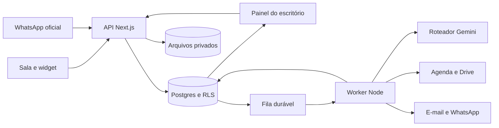

# Arquitetura e contratos

## Stack definida

| Camada | Escolha | Motivo |
| --- | --- | --- |
| Runtime | Node.js 24 LTS; referência consultada: 24.21.0 | Um runtime para web, integrações e tarefas |
| Web e API | Next.js 16, App Router; referência consultada: 16.3.5; React compatível | Sala pública, painel e endpoints no mesmo projeto |
| Linguagem | TypeScript com `strict` | Contratos compartilhados e erros detectáveis antes de executar |
| Interface | Tailwind CSS + componentes shadcn/ui; React Hook Form + Zod | Componentes acessíveis e formulários consistentes |
| Banco | Supabase Postgres, migrações SQL e tipos gerados | Dados transacionais, autenticação e políticas de acesso |
| Acesso | Supabase Auth + `@supabase/ssr` e `@supabase/supabase-js` | Login e sessões verificadas no servidor |
| Arquivos | Supabase Storage, buckets privados | URLs temporárias e metadados associados aos casos |
| Verificação de arquivos | Validação local leve + `MalwareScanner` por HTTPS; primeiro adaptador de referência: Cloudmersive | Quarentena e varredura sem carregar base de antivírus no worker; ativação depende do contrato e orçamento do serviço |
| Busca | Postgres FTS + pgvector de 768 dimensões, módulo E11 opcional | Busca lexical e semântica sem outro banco; o dossiê básico usa fontes diretas |
| Execução em segundo plano | Supabase Queues/pgmq + worker Node.js | Trabalhos persistentes e reprocessáveis |
| Gemini | SDK oficial `@google/genai`, atrás de adaptador próprio | Controle explícito de modelo, custos e validações |
| Google Workspace | Biblioteca oficial `googleapis`, OAuth web server; módulos opcionais | Sincronização com a agenda interna e cópias no Drive, ativadas depois do primeiro atendimento |
| SaaS | Stripe Checkout + Customer Portal + webhooks | Assinatura sem armazenar cartão no produto |
| E-mail | Resend por adaptador + domínio autenticado | Mensagens transacionais e SMTP próprio para autenticação |
| Hospedagem | Render: serviço web Node e background worker, pagos no piloto | Processos persistentes; evita depender de execução em memória após uma requisição |
| Qualidade | Vitest, Playwright com `@axe-core/playwright`, testes SQL/RLS e CI do GitHub | Validar regras, isolamento, jornadas e acessibilidade automatizável; complementar com revisão manual do documento 07 |
| Observabilidade | Logs JSON com Pino e métricas internas de jobs/IA | Rastrear falhas sem registrar conteúdo confidencial nos logs |

Versões de referência devem ser verificadas em E00 e fixadas sem intervalos no manifesto/lockfile. Corrigir patches de segurança antes do piloto. Não adicionar Python, Redis, LangGraph, Temporal, LangChain, um segundo backend ou um segundo banco sem uma decisão registrada pela supervisora.

Node 24 está em LTS e o Next admite implantação como servidor Node. O changelog Supabase consultado já exige atenção ao abandono de Node 20 e à exposição explícita de tabelas. [Node](https://nodejs.org/en/about/previous-releases), [Next](https://nextjs.org/docs/app/getting-started/deploying), [Supabase](https://supabase.com/changelog).

## Organização do repositório futuro

```text
apps/
  web/src/app/               # páginas e rotas HTTP
  web/src/features/          # sala, revisão, agenda, CRM, configuração
  web/src/server/            # autenticação, acesso e adaptação HTTP
  worker/src/                # consumo de filas e conectores em segundo plano
packages/
  contracts/src/             # Zod, eventos, tipos de resposta; sem segredos
  domain/src/                # transições e regras; sem Next/SDK externo
  db/src/                    # clientes, repositórios e tipos gerados
  ai/src/                    # roteamento, prompts e adaptador Gemini
  integrations/src/          # Google, cobrança, e-mail e WhatsApp
  ui/src/                    # componentes compartilhados
supabase/
  migrations/
  tests/                     # isolamento, privilégios e concorrência
  seed.sql                   # exclusivamente dados sintéticos
tests/e2e/
tests/evals/
docs/evidence/               # evidências das entregas, sem dados reais
planning/                    # especificações e configurações ilustrativas
```

Usar pnpm workspaces, sem Turborepo inicialmente. Escolher e fixar a versão exata de pnpm em E00. Frontend importa contratos; código com segredos deve ser marcado e testado como exclusivo de servidor. O domínio não chama SDKs diretamente.

**Recursos opcionais:** registrar no servidor `knowledge`, `google_calendar`, `google_drive`, `widget`, `whatsapp` e `live_voice`, desativados por padrão e habilitados por escritório somente após aceite do módulo. Proteger também endpoints e jobs, não apenas esconder botões. Core com agenda interna não depende dessas flags. Integração não configurada não impede publicar a sala. Não criar tabelas, dependências ou serviços de módulos futuros em E00 só porque aparecem nesta arquitetura.

## Visão da execução



A web confirma recebimento somente depois de persistir. Processamento demorado ocorre no worker. Uma atualização no banco, o evento correspondente e a inclusão do trabalho precisam formar uma transação. Não usar `setTimeout` ou tarefa em memória como garantia de envio futuro.

Para simplificar o primeiro chat, `POST` retorna um identificador e o navegador consulta o estado enquanto há resposta pendente, com intervalo de 1 s e limite de espera. Ao concluir, para de consultar. Streaming de respostas não validadas não faz parte do primeiro fluxo. Otimização por SSE pode entrar se a medição justificar.

## Modelo de dados

Todas as tabelas de negócio têm `id UUID`, `tenant_id`, datas de criação/alteração e, quando mutáveis, `version`. Usar `timestamptz` para instantes, `date` para datas civis e centavos inteiros mais moeda para dinheiro. Não usar ponto flutuante para honorários.

| Grupo / tabelas | Campos e invariantes principais |
| --- | --- |
| `tenants`, `memberships`, `rooms` | Escritório; membro/role/status; slug único, domínio permitido, configurações publicadas e versão do roteiro |
| `contacts`, `channel_identities` | Nome/contato; canal, identificador externo e verificação. Não unir pessoas automaticamente só por nome ou telefone parecido |
| `cases`, `case_access` | Contato, área, responsável, fase comercial, `intake_stage`, versão do roteiro; lista de usuários/papéis autorizados |
| `conversations`, `messages` | Canal, caso, sessão, modo automático/humano, sequência; ID externo único por conexão/canal |
| `public_sessions` | Hash do token, escopo de sala/conversa, expiração, revogação e confirmação de contato; acesso apenas pelo backend |
| `consent_records` | Finalidade específica, texto/versão apresentado, decisão, origem e data; sem tratar tudo como consentimento genérico |
| `documents`, `document_versions`, `document_pages` | Caso, hash, tamanho, MIME detectado, caminho privado, estado; texto e coordenadas por página quando disponíveis |
| `document_scan_attempts` | Versão/hash, scanner, resultado, tentativa e instante; sem conteúdo bruto; liberação vinculada à versão verificada |
| `facts`, `evidence_refs` | Campo, valor, unidade, status; fonte documento/mensagem, versão, página/trecho; divergências preservam os valores |
| `knowledge_assets`, `knowledge_chunks` | Dono, audiência `public_office/internal_office/case_private`, caso opcional, texto, `tsvector`, embedding, modelo e versão |
| `dossiers`, `approvals` | Snapshot imutável, hash, fontes, pendências; decisão, ator, instante e hash aprovado |
| `tasks`, `notes` | Caso, responsável, vencimento, estado e visibilidade |
| `calendar_resources`, `availability_rules`, `appointments` | Recurso, modo interno/Google, horários e fuso; início/fim, confirmação e sincronização separadas; ID externo opcional |
| `integration_connections`, `integration_secrets` | Provedor, proprietário, tenant, escopos e estado; tokens criptografados em esquema privado |
| `subscriptions`, `usage_counters` | Cliente/assinatura externa únicos, período, estado, franquias e consumo |
| `domain_events`, `outbox`, `job_runs` | Evento versionado, alvo/ação deduplicáveis, tentativas, último erro sanitizado e próxima tentativa |
| `ai_requests`, `quota_reservations`, `quota_buckets` | Tarefa, modelo, credential ID não secreto, tokens/custo, limite e reserva atômica |
| `audit_events` | Ator, ação, entidade, versão, request ID e mudança redigida; sem tokens ou transcrições em logs operacionais |
| E26–E28: `proposals`, `contracts`, `receivables`, `automation_rules` | Versões, assinaturas externas, parcelas e regras aprovadas de automação |
| E24: `staff_channel_bindings`, `command_proposals` | Vínculo autenticado do profissional, comando, nonce, expiração e snapshot a confirmar |

Relações entre tabelas de tenant devem usar chaves compostas `(tenant_id, id)` e FKs compostas equivalentes. Isso impede associar um documento ao caso de outro escritório por engano. Criar índices para os acessos reais: `(tenant_id, updated_at)`, `(tenant_id, case_id, created_at)`, associação de membro/usuário e identificadores externos. Não fazer índices de tudo por hábito.

## Autorização e fronteiras

1. Rotas profissionais verificam identidade no servidor com `getClaims` ou `getUser` conforme necessidade de sessão atual. `getSession` sozinho não autoriza operação. Ler a associação ativa ao tenant e o acesso ao caso no banco.
2. CRUD profissional usa cliente Supabase da sessão e RLS. `tenant_id` recebido é no máximo uma seleção a validar; não é prova de autorização. Não usar `user_metadata` como papel de acesso.
3. RLS protege toda tabela exposta. Definir `USING` e `WITH CHECK` apropriados, grants explícitos e acesso aos documentos associados. Views devem respeitar RLS (`security_invoker`) ou permanecer privadas.
4. Visitantes usam somente a API pública, com token aleatório de sessão armazenado como hash no servidor. Não recebem credenciais privilegiadas nem acesso direto às tabelas do CRM.
5. Um módulo pequeno de backend faz operações públicas/integrações privilegiadas. Cada função valida sessão ou assinatura externa, deriva o tenant de vínculo confiável, confirma acesso ao objeto e registra a ação. A chave privilegiada pode ignorar RLS; portanto RLS não substitui essas validações.
6. Filas, tokens OAuth, reservas de cota e auditoria operacional ficam em esquema não exposto. RPCs privilegiadas revogam `EXECUTE` de `PUBLIC`, `anon` e `authenticated`; conceder somente ao papel de backend necessário. Preferir `SECURITY INVOKER`; qualquer exceção exige revisão explícita de privilégios, identidade/contexto e `search_path` em E02/E05.
7. Armazenamento privado com autorização por objeto; URL de download assinada por prazo curto, inicialmente 60 s. O caminho carrega tenant/caso/versão mas o caminho sozinho não autoriza acesso.
8. Dono, advogado e assistente têm políticas distintas; remoção de membro revoga acesso. Operações sensíveis consultam associação/sessão atual e não dependem exclusivamente de JWT antigo.

Os testes devem tentar os caminhos diretos da API de dados, Storage, RPC, pesquisa, portal e downloads. Testar apenas ocultação de botão não demonstra isolamento.

## Estado e contrato de mensagem

Separar **fase comercial** (`new`, `in_progress`, `awaiting_client`, `review`, `engaged`, `closed`) de **etapa da coleta** (`welcome`, `identity`, `facts`, `documents`, `ready`, `human`). Agendamento é uma entidade própria; pode ocorrer enquanto documentos estão pendentes. Pausar automação não muda a propriedade do caso.

Contrato conceitual a implementar em Zod:

```ts
type InboundEvent = {
  schemaVersion: 1;
  eventId: string;
  connectionId: string;
  externalMessageId: string;
  conversationId: string;
  kind: 'text' | 'audio' | 'document' | 'action';
  receivedAt: string; // UTC, atribuído pelo servidor
  payloadRef: string; // conteúdo no armazenamento autorizado
};

type TransitionResult = {
  expectedVersion: number;
  nextStage: 'welcome' | 'identity' | 'facts' | 'documents' | 'ready' | 'human';
  actions: Array<{ type: string; payload: unknown }>;
};
```

O envelope confiável é produzido pelo servidor; mensagens externas não escolhem tenant, autor ou papel. O código carrega estado e versão, valida um evento, calcula a transição pura e persiste por comparação de versão. Uma conversa tem no máximo um turno automático em execução. Mensagens simultâneas entram em sequência; uma resposta calculada sobre versão antiga deve ser descartada/recalculada antes de publicar.

Eventos iniciais: `message.received`, `document.received`, `document.extracted`, `dossier.ready`, `approval.recorded`, `appointment.requested`, `appointment.confirmed`, `integration.failed`, `subscription.changed`, `human.handoff_requested`. Cada consumidor deduplica por `(event_id, handler_version)`.

## APIs do núcleo e dos módulos

Todas retornam `{ data, error, requestId }`; erros possuem código estável e mensagem curta. Mutação recebe chave de idempotência e, se alterar versão existente, `expectedVersion`. Limitar tamanho do corpo e validar Zod antes de trabalho caro.

Implementar cada rota no cartão correspondente. Google é E13/E14.3/E15, WhatsApp é E23–E25 e Live é E22; não fazem parte da fundação nem são pré-requisitos para a sala por link.

| Rota | Entrada / saída | Regra essencial |
| --- | --- | --- |
| `GET /api/public/rooms/{slug}` | Configuração pública publicada | Sem prompts internos, contatos privados ou tokens |
| `POST /api/public/sessions` | Sala e verificação antiabuso → token/conversa | Rate limit e origem; escopo limitado |
| `POST /api/public/messages` | Token, conteúdo ou referência de upload → mensagem/job | Persistência antes do aceite; duplicata devolve resultado original |
| `GET /api/public/conversations/{id}` | Token → mensagens e ações da própria conversa | Proibir enumeração de outros IDs |
| `POST /api/public/uploads` | Metadados → autorização temporária de envio | MIME/tamanho/quota; objeto em quarentena |
| `POST /api/public/uploads/{id}/complete` | Upload finalizado → estado de processamento | Conferir objeto real, hash e vínculo à sessão |
| `GET /api/public/slots` | Datas/recurso permitido → opções curtas | Apenas livre/ocupado; sem títulos de agendas privadas |
| `POST /api/public/appointments` | Opção confirmada → reservado/pendente/confirmado | Rechecar agenda, expiração e concorrência |
| `GET /api/cases`, `GET /api/cases/{id}` | Filtros/paginação → dados autorizados | RLS e ACL do caso |
| `POST /api/cases/{id}/actions` | Tipo permitido, versão e payload → resultado | Permissão por ação; não aceitar comando SQL ou URL arbitrária |
| `POST /api/dossiers/{id}/approve` | Versão/hash/decisão → aprovação | Só papel profissional autorizado; snapshot imutável |
| `GET /api/integrations/google/start` e callback | Estado assinado e consentimento | Vínculo à sessão/tenant, escopos efetivos e proteção CSRF |
| `POST /api/billing/checkout`, `/portal` | Plano/retorno permitido → URL hospedada | Preço definido no servidor |
| `POST /api/webhooks/stripe` | Corpo original + assinatura | Deduplicar evento; estado confiável via provedor |
| `POST /api/webhooks/whatsapp` | Corpo original + assinatura | Vínculo por conexão/número empresarial, não por campo livre |
| `POST /api/voice/session` | Sessão autorizada → sessão de voz | Liberado somente em E22, com limite de duração/uso |
| `GET /health/live`, `GET /health/ready` | Saúde mínima | Sem expor configuração ou segredos |

No iframe, não depender de cookies de terceiros. Token público curto fica em memória do iframe; fechar o painel conserva a instância. Recarregar ou retomar em outro dispositivo exige recuperação por contato verificado, sem devolver histórico só por conhecer um telefone. Tokens de acesso não vão em parâmetros de URL nem em logs.

## Fila, repetição e recuperação

Usar filas duráveis registradas (`interactive`, `documents`, `integrations`, `maintenance`). O worker lê com janela de visibilidade, renova o trabalho em curso quando necessário e arquiva depois do resultado persistido. Prioridade é responsabilidade do escalonador entre filas; a fila individual é FIFO. [Supabase Queues](https://supabase.com/docs/guides/queues/quickstart).

Um efeito externo pode ter ocorrido antes de uma queda do worker. Por isso, a promessa operacional é processamento com repetição segura, não “exactly once” universal. Manter `outbox` com `pending/sending/sent/unknown/failed`, chave estável no provedor quando suportada e reconciliação. Em resultado incerto, consultar o provedor; não repetir cegamente um envio ou criação de evento.

Aplicar backoff exponencial com jitter e limite por tipo. Integrações: até cinco tentativas automáticas com reconciliação; IA segue o limite global do documento 04. Depois, fila de falha com botão seguro de reprocessar. Retentativa não pode abrir uma cadeia ilimitada de novas tentativas de IA.

## Agenda interna e Google Agenda opcional

**E14.1–E14.2 — padrão interno:** disponibilidade vem das regras de horários, bloqueios e compromissos do Postgres. Guardar instantes em UTC e fuso IANA do profissional, inicialmente `America/Sao_Paulo`. Slot tem validade de 2 min; visitante confirma; backend revalida e grava a reserva em transação. Restrição de exclusão por recurso e intervalo `[início, fim)` evita sobreposição interna. Confirmação, cancelamento e reagendamento funcionam sem chamadas ao Google.

Separar `booking_status` de `sync_status`. Na agenda interna, o compromisso pode ficar `confirmed` com sincronização `not_applicable`. Em modo Google, o fluxo abaixo aguarda resultado externo. O recurso de agenda guarda `calendar_mode: internal | google`, padrão `internal`, e cada reserva registra o modo utilizado. Ativar Google não recria nem migra silenciosamente compromissos antigos.

**E14.3, após E13 — sincronização opcional:** criar uma agenda secundária do aplicativo e consultar livre/ocupado da agenda principal. Escopos propostos: `calendar.app.created` e `calendar.freebusy`. Ler outras agendas ou permitir escolha ampla só quando solicitado pelo escritório, acrescentando os escopos estritamente necessários. Essa escolha reduz a necessidade de editar eventos pessoais. [Escopos Calendar](https://developers.google.com/workspace/calendar/api/auth).

Guardar instantes em UTC, fuso IANA do profissional e fuso apresentado ao visitante. Horário padrão do escritório: `America/Sao_Paulo`, editável. Incluir duração, intervalo entre consultas, antecedência mínima e dias bloqueados.

Fluxo: consultar free/busy → oferecer slot com validade de 2 min → visitante confirma → criar reserva interna curta → rechecar free/busy → gravar evento com ID determinístico → marcar confirmado. Restrição de exclusão por recurso e intervalo evita duas reservas internas sobrepostas; considerar intervalos como `[início, fim)`.

A agenda externa não participa da transação do Postgres. Ainda pode ocorrer concorrência com uma alteração manual no Google; reconciliar e exibir conflito, sem prometer impossibilidade absoluta de choque externo. Se houver timeout, consultar pelo ID determinístico antes de recriar.

Sincronizar somente os eventos gerenciados pelo app. Polling incremental é suficiente na primeira entrega do conector; `syncToken` inválido exige sincronização completa. Notificações push, se adotadas depois, precisam renovação de canal. Falha da integração deixa novas confirmações externas pendentes e informa a equipe, sem alterar compromissos já confirmados. Não voltar automaticamente ao modo interno: a equipe pode escolhê-lo para novas reservas após ver as pendências; operações externas incertas continuam sendo reconciliadas antes de liberar seus intervalos.

## Google Drive e documentos

E15 é opcional. Sem conexão, arquivos privados, extração e dossiê funcionam normalmente no armazenamento interno. Uma falha de cópia no Drive não muda a aprovação técnica do arquivo canônico.

Usar `drive.file`; criar uma pasta do app e permitir seleção explícita de arquivos pelo Picker quando necessário. Não solicitar acesso total ao Drive por conveniência. [Escopos Drive](https://developers.google.com/workspace/drive/api/guides/api-specific-auth).

Supabase é o registro transacional e a cópia canônica dos anexos no piloto. Drive recebe cópia assíncrona aprovada pelo escritório. Nomear pastas/arquivos por IDs e rótulos controlados, evitando expor dados desnecessários. Guardar `fileId`, versão/hash e estado da cópia. Não criar links públicos automaticamente.

Drive não é usado para armazenar tabelas do CRM: o produto precisa de transações, chaves, permissões, consultas e concorrência consistentes. Escolher uma pasta não significa autorização ilimitada para ler seu conteúdo; verificar cada arquivo e o acesso efetivo do escopo.

Refresh tokens ficam criptografados com chave de servidor versionada; renovar com trava por conexão. Não substituir refresh token existente por vazio em um callback. Consentimento parcial, revogação e `invalid_grant` geram estado “Reconectar Google”, sem apagar arquivos nem interromper o CRM.

Login Google usa apenas os escopos de identidade necessários; Agenda e Drive pedem consentimento incremental em Integrações. Para apps externos em `Testing`, refresh tokens de escopos adicionais normalmente expiram em sete dias; há exceção quando só se usam escopos básicos de identidade. Avisos e verificações dependem do estado do app e dos escopos: `drive.file` é não sensível, e não equivale a solicitar todo o Drive. E13 registra publicação, verificação aplicável e reconexão; não prometer token permanente. [OAuth](https://developers.google.com/identity/protocols/oauth2), [estados do aplicativo](https://developers.google.com/identity/protocols/oauth2/production-readiness/overview), [classificação dos escopos Drive](https://developers.google.com/workspace/drive/api/guides/api-specific-auth).

## Assinatura, mensagens e conectores

Stripe é responsável pelo checkout e portal. Verificar assinatura do webhook usando corpo bruto. Deduplicar IDs e consultar estado atual quando necessário para lidar com eventos fora de ordem. A página de retorno do checkout nunca concede acesso por si só. Definir carência, cancelamento ao fim do período e exportação antes do lançamento. [Stripe](https://docs.stripe.com/billing/subscriptions/webhooks).

Cada adaptador implementa funções pequenas, como `getAvailability`, `createAppointment`, `copyDocument`, `sendMessage` e `getSubscription`. Retornos padronizados incluem ID externo, estado confirmado/incerto e erro repetível ou definitivo. Credenciais pertencem a uma conexão, não ao prompt.

WhatsApp usa Cloud API oficial. Áudio de mensagem é arquivo assíncrono; chamada telefônica ao vivo é outro recurso, fora da primeira integração. A conexão precisa de credenciais, webhooks, número empresarial e onboarding por escritório. Mensagens livres dependem da janela de atendimento; mensagens fora dela usam modelo aprovado e permissão aplicável. [Política WhatsApp](https://business.whatsapp.com/policy), [preços e janela de serviço](https://whatsappbusiness.com/products/platform-pricing/).

Google e Meta têm processos externos próprios, que não entram no cadastro obrigatório do SaaS. Mostrar cada conexão como não conectada, conectando, ativa, pendente ou requer reconexão, conforme resultado real. Indisponibilidade de WhatsApp não interrompe atendimentos pelo link. Priorizar E23–E25 antes de Live após validar o piloto; antecipar a pesquisa de requisitos não exige conectar cada escritório no primeiro acesso.

Comando do profissional requer vínculo iniciado no painel e verificado no canal. Um telefone presente em mensagem não concede papel administrativo. Alterações sensíveis produzem proposta com caso, valores, versão, prazo e nonce; confirmação pode acontecer no painel com sessão reforçada. Eventos duplicados ou atrasados não reaplicam o comando.

Webhooks de saída futuros são assinados, versionados e repetíveis. MCP pode expor essas mesmas funções, sem ganhar privilégios extras. Integrações com tribunais exigem contrato específico; a disponibilidade de um protocolo não significa acesso a peticionamento ou a processos sigilosos.

## Operação e dados

Preparar três ambientes lógicos: local sintético, staging sintético e produção. Não clonar conversas reais para staging. Guardar segredos em gerenciador da hospedagem; `.env.example` contém apenas nomes e placeholders. Desativar gravação de corpo, cabeçalhos de autorização e URLs assinadas nos logs.

### Upload e varredura fora do worker

Uploads entram em quarentena privada: limite inicial 10 MB/arquivo, PDF/JPEG/PNG; áudio até 2 min por mensagem com formatos compatíveis fixados em E17. O backend confere tamanho real, extensão permitida, MIME detectado por bytes e vínculo a versão/hash imutável. Depois da varredura, parsers isolados aplicam teto de 20 páginas, limites de descompressão, memória e duração. Não executar PDF, macros ou código de arquivo; conteúdo ativo/criptografado não suportado é rejeitado. Limites efetivos são o menor entre o configurado e o suportado pelo scanner contratado.

Checar MIME e assinatura binária não prova ausência de malware. O worker mantém a fila e chama um scanner por HTTPS; não hospeda `clamd`, `freshclam` ou sua base. A documentação do ClamAV recomenda pelo menos 3 GiB, preferindo 4 GiB no contêiner. Se adotado futuramente, precisa serviço dedicado e orçamento medido, sem dividir a memória do worker. [ClamAV em Docker](https://docs.clamav.net/manual/Installing/Docker.html), [OWASP — proteção de uploads](https://cheatsheetseries.owasp.org/cheatsheets/File_Upload_Cheat_Sheet.html).

Contrato `MalwareScanner.scan({ documentVersionId, sha256, bytes, detectedMime })` retorna `clean | infected | rejected | unavailable`, mais `scanner`, instante e ID da tentativa. Persistir o resultado apenas se versão/hash ainda forem os mesmos. `rejected` cobre formato/conteúdo proibido, sem afirmar infecção. `unavailable` cobre timeout, 429, serviço não configurado ou resposta inválida; conserva quarentena. Só `clean` libera extração, indexação, visualização, download ao profissional ou cópia no Drive. Acesso ao objeto em quarentena é restrito ao backend de varredura; o usuário vê metadados e pendência.

Primeiro adaptador de referência: **CloudmersiveMalwareScanner**, via `POST https://api.cloudmersive.com/virus/scan/file/advanced`, multipart `inputFile`, cabeçalho `Apikey` de segredo de servidor. Fixar versão do contrato em E07; configurar bloqueio de executáveis, scripts, arquivos inválidos/criptografados, macros e ações indesejadas. `CleanResult: true` só vira `clean` se resposta completa e flags forem coerentes; detecção em `FoundViruses` vira `infected`; bloqueio explícito de política vira `rejected`; retorno ambíguo vira `unavailable`. Não usar resposta HTTP 200 como aprovação automática. [API oficial do scanner](https://api.cloudmersive.com/docs/virus.asp).

Enviar bytes com nome técnico, sem credenciais do Storage e sem URL fornecida pelo visitante. Configurar timeout inicial de 30 s, até três tentativas com backoff, no máximo duas varreduras simultâneas por worker e teto global de chamadas/custo; medir e ajustar em E07. Um retry pode ser cobrado novamente pelo scanner. Registrar só metadados técnicos, sem conteúdo ou nome pessoal. Não enviar documentos para serviços públicos de compartilhamento de amostras.

E07 registra em `planning/external-setup.md` plano contratado, tamanho máximo, região, retenção, termos aplicáveis e custo do scanner antes da ativação real. A API é referência técnica; contratação e adequação ao acervo não estão presumidas. Sem serviço configurado, `unavailable` mantém o upload pendente; modo simulado somente com arquivos sintéticos fora de produção. O piloto documental exige o scanner ativo e testado em E19/E20. Nenhuma indisponibilidade é convertida silenciosamente em `clean`.

Plano de retenção inicial, a validar contratualmente: áudio bruto descartado após transcrição confirmada, no máximo 24 h; uploads rejeitados em 24 h; logs técnicos sem conteúdo por 30 dias; leads abandonados por 90 dias, salvo retenção documentada. Acervo de clientes segue política do escritório e bloqueios legais aplicáveis. Exclusão remove também derivados, embeddings e cópias do Drive quando autorizada; backups expiram segundo política publicada.

Backups do banco e dos objetos são tratados separadamente. Testar restauração de ambos. Metas iniciais propostas: RPO até 24 h e RTO até 8 h, sem anunciá-las como SLA antes do teste. Alertar sobre jobs atrasados, falhas de integração, fila sem consumidor, cota quase esgotada e gastos fora do orçamento. Health check não equivale a teste de atendimento ponta a ponta.
